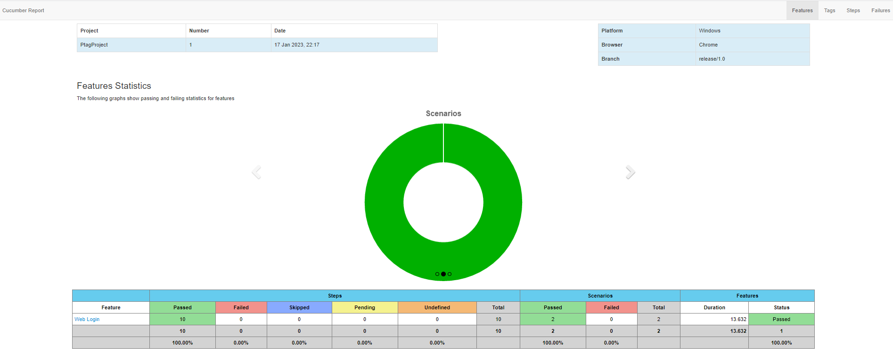

# **PetagPivotal**
PetagPivotal es un framework de testeo de UI de la aplicacion Pivotal Tracker que es un gestor de desarrollo
de proyectos 
# #Requisitos
* Tener una cuenta creada en la aplicación web Pivotal Tracker.
* Crear una API key para la cuenta de Pivotal Tracker 
# #Configuracion 
Ir al file "gradle.properties: y proveer los siguientes datos

* user= Nombre de usuario creado previamente
* password= Password de usuario creado previamente
* TrackerToken = X-TrackerToken
* BaseUrl = https://www.pivotaltracker.com
* ApiToken = Api Token creado previamente
* authentication.baseURI = https://www.pivotaltracker.com/services/v5
* Browser = Browser en el cual se desea ejecutar las pruebas. El framework soporta las ejecuciones
en "Chrome", "FireFox" y "Edge"

# #Ejecucion
Dirigirse hacia la clase "java/Runner.java" en la estructura del proyecto(panel lado izquierdo)
apretar boton derecho sobre la clase y escoger la opcion: Run "Runner".

# #Reportes
Dirigirse hacia el file "reports" presionar boton derecho del mouse sobre el file "report-feature_xxxxxxx"
escoger la opcion "Open In" > "Broser" > Chrome, esto abrirá el navegador chrome y mostrará un informe de los
resultados dela ejecución de manera interactiva.  

E.g:

